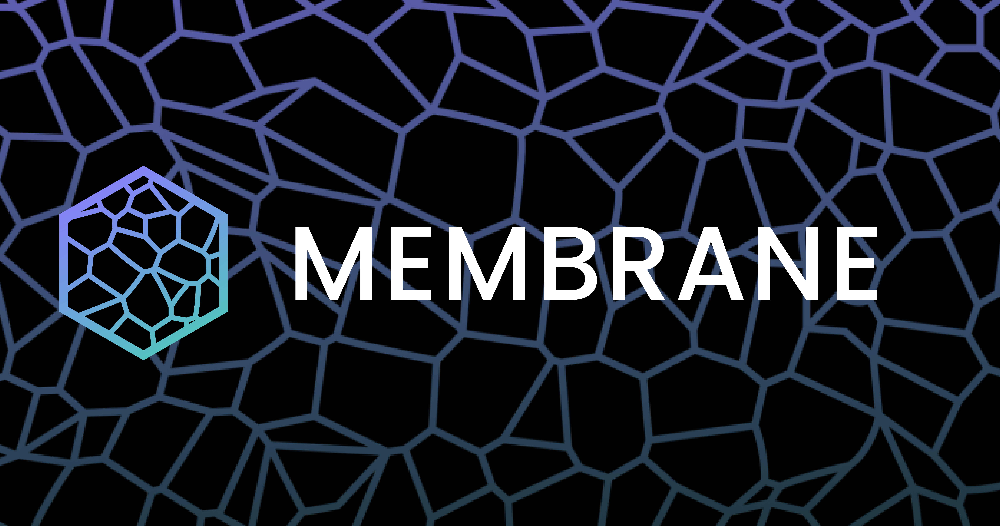

# What is Membrane?

<figure><figcaption></figcaption></figure>


[overview](protocol/overview/)



[liquidation-mechanism.md](protocol/liquidation-mechanism.md)



[risk-management.md](protocol/risk-management.md)



[mbrn-tokenomics.md](protocol/mbrn-tokenomics.md)


## Unique User Interactions

* [**Bundles** ](protocol/overview/asset-bundles.md)enable users to create low-volatility or diversified collateral risk profiles
* **Self liquidate** with CDT held in the [Stability Pool](smart-contracts/stability-pool.md)
* Collateral [redemptions ](smart-contracts/positions.md#redeemcollateral)using CDT
